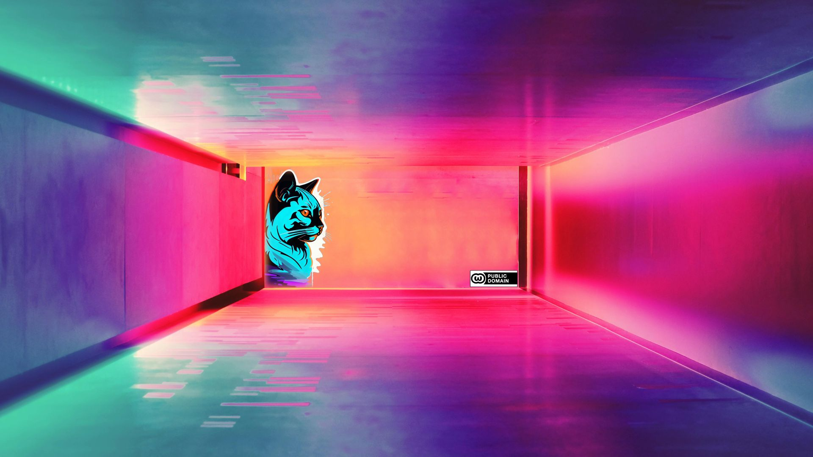

#  <u>LICENCE</u>

----
# LE PROJET
1. ### [LIRE le volet 1 : "p’Aoriiu Jiuuijh"](https://github.com/Dfalm-Original/Jiuuijh/blob/main/paoriiu/README.md)
1. ### [Mon Univers Aquatique : Si tu as pas peur de te faire spoiler](https://github.com/Dfalm-Original/Jiuuijh/blob/main/paoriiu/spoiler.md)
1. ### [Présentation du projet en Résumé](Presentation.2.Resume.md)
1. ### [Présentation version Longue du projet](Presentation.1.Longue.md)
1. ### [La licence WTFPL](Licence.md)
1. ### [Encyclopédie +/- Lexique](https://paoriiu.jiuuijh.fr/encyclopedie)
---
# LICENCE + English Below 👇

<h3>🔵⚪️🔴<b>Quand_une_idee_est_bonne_elle_appartient_a_tout_le_monde</b>.<i><a href="https://fr.wikipedia.org/wiki/WTFPL" target="_blank">licence</a></i>
</h1>
<h3>🌎🌍🌏<b>When_an_idea_is_good_it_belongs_to_everyone</b>.<i><a href="https://en.wikipedia.org/wiki/WTFPL" target="_blank">licence</a></i>
</h1>

🔵⚪️🔴 Si vous êtes une bonne personne vous citez vos sources et l'auteur qui vous a inspiré

Sinon , vous vous attribuez la valeur d'une autre personne ou pire vous encaissez les dividendes de son travail
 C'est pas bien joli joli 
Mais j'ai confiance en vous, vous n'etes pas une personne cupide

🌎🌍🌏 If you are a good person you cite your sources and the author who inspired you

Otherwise, you attribute to yourself the value of another person or worse you collect the dividends of his work
 It's not realy nice 
However I believe in you, you are not a greedy person

---
---

🔵⚪️🔴 Tout ce que je produits est en <b>"zero"</b> licence  
Libre a vous d'en faire l'usage dont vous avez besoin ou que vous trouvez utile 
 

<u>Zero Licence</u> :
<a href="https://creativecommons.org/publicdomain/zero/1.0/deed.fr" target="_blank">https://creativecommons.org/publicdomain/zero/1.0/deed.fr</a>

 <u>Licence Alternative </u> : <a href="https://fr.wikipedia.org/wiki/WTFPL" target="_blank">https://fr.wikipedia.org/wiki/WTFPL</a> 

🌎🌍🌏 Everything I produce is under <b>"zero"</b> license  
You are free to use it as you need or find useful  

<u>Zero Licence</u> :
<a href="https://creativecommons.org/publicdomain/zero/1.0/" target="_blank">https://creativecommons.org/publicdomain/zero/1.0/</a> 

<u>Licence Alternative </u>
 : <a href="https://en.wikipedia.org/wiki/WTFPL" target="_blank">https://en.wikipedia.org/wiki/WTFPL</a>  

> <u>GITHUB Guide</u> : https://docs.github.com/fr/repositories/managing-your-repositorys-settings-and-features/customizing-your-repository/licensing-a-repository

---
## <u>Vous avez le droit de :</u>

partager 
copier 
distribuer 
communiquer 
adapter 
modifier 
remixer 
transformer 
créer à partir de l’original 
vous attribuer la paternité 
vendre 
revende 
exploiter 
attribution commercial 
faire une adaptation sous toute autre forme différente 
vous attribuer l’antériorité à l’idée originale 
mentir 
tricher 
vous faire de l’argent 
traduire dans d’autres langues 
participer 
detester 
dire que c’est de la merde et que ça devrait pas exister 
faire des propositions 
ne rien comprendre 
ne rien comprendre mais demander des explications 
demander de modifier des parties (peu import evos motifs) 
faire vous même les modifications que vous voulez 
forker 
aimer, tout simplement 
ou pas. 

---

## === ORIGINAL  ===

                          LICENCE PUBLIQUE RIEN À BRANLER
                                Version 1, mars 2009
    
    Copyright (C) 2009 Sam Hocevar
    14 rue de Plaisance, 75014 Paris, France
    
    La copie et la distribution de copies exactes de cette licence sont
    autorisées, et toute modification est permise à condition de changer
    le nom de la licence.
    
                          CONDITIONS DE COPIE, DISTRIBUTON ET MODIFICATION
                                DE LA LICENCE PUBLIQUE RIEN À BRANLER
    
    0. Faites ce que vous voulez, j’en ai RIEN À BRANLER.

https://fr.wikipedia.org/wiki/WTFPL
---
----
----
# ENGLISH PART
----
                          DO WHAT THE FUCK YOU WANT TO PUBLIC LICENSE
                                 Version 2, December 2004
    
    Copyright (C) 2004 Sam Hocevar <sam@hocevar.net>
    
    Everyone is permitted to copy and distribute verbatim or modified
    copies of this license document, and changing it is allowed as long
    as the name is changed.
    
                          DO WHAT THE FUCK YOU WANT TO PUBLIC LICENSE
              TERMS AND CONDITIONS FOR COPYING, DISTRIBUTION AND MODIFICATION
    
    0. You just DO WHAT THE FUCK YOU WANT TO.

https://en.wikipedia.org/wiki/WTFPL
---

---

### Dfalm
